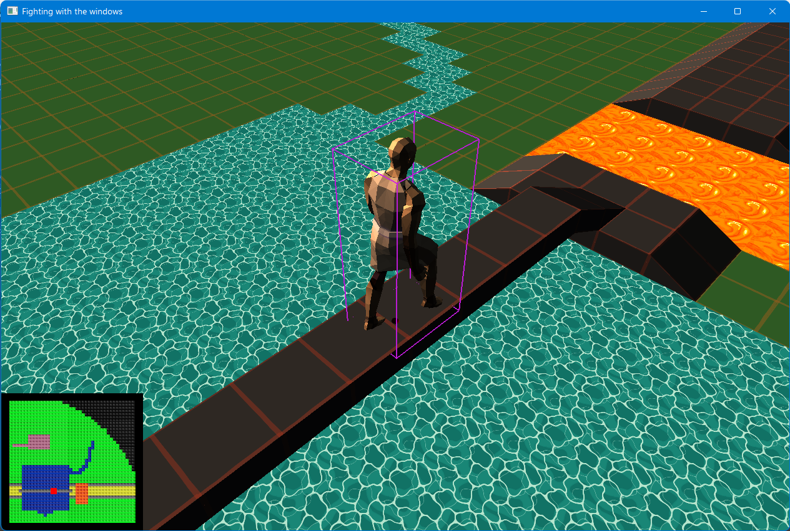
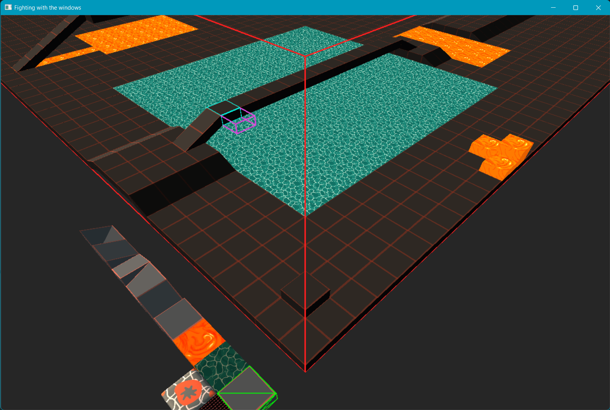

# Earth Bender Game

Demo and basis of a game that is in the making 👷‍♂️. It contains a play mode and an editor. Currently only basic walking with a simple character is in the play mode, waiting to be extended. The editor has some more features already for creating rooms made out of tiles.

## Building

It is built using Microsoft Visual Studio (2022 - 17.10+). Install at least MSVC and a Windows SDK - which is included in "Desktop development with C++". No further libraries needed. Open .sln project, select "Debug" "x64" and run with "Local Windows Debugger".

## Game Preview

# Game Controls

- Tab Switch to editor
- N Next room (cycle)
- Arrow-Keys/ASDW Walk
- O switch orthographic/stereographic projection
- Ctl-F Fullscreen toggle
- Esc Quit Program

## Editor Preview

### Editor Controls

- Arrow-Keys/ASDW Move camera
- Mouse-Wheel Zoom
- N Next room (cycle)
- P Save the current room
- Left-mouse-button Place block next to hovered block / Select template block
- Right-mouse-button Delete hovered block
- Tab Play test current room
- Ctl-F Fullscreen toggle
- Esc Quit Program

### Further Ideas/Goals (for myself)

- entity system for multi monster fights (discussion in entities.hpp)
- abstract away platform rendering / make a library for rendering (see https://github.com/valiet/quel_solaar -> have multibple c files per library and one header file)
   - do the same for user input (keyboard, xbox-controller, ...)
   - implement sound in a similar way
- make doors to other rooms and autogenerate dungeon
